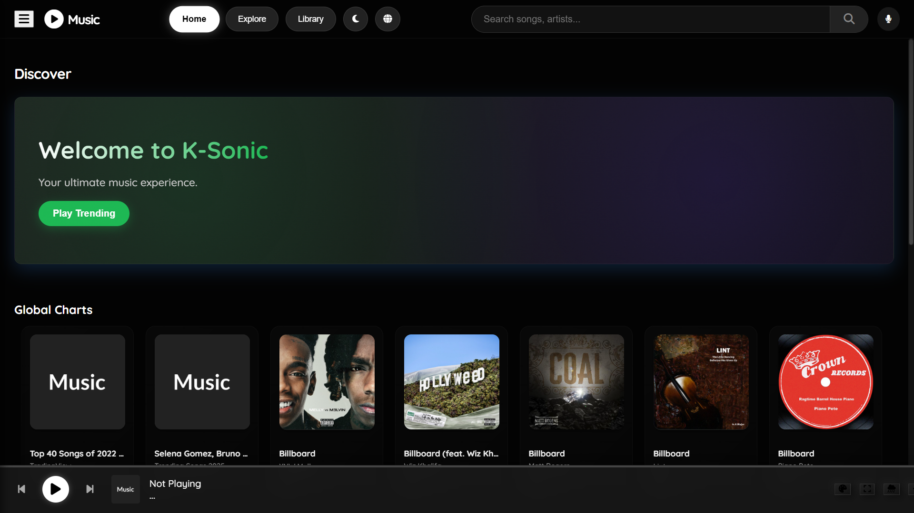
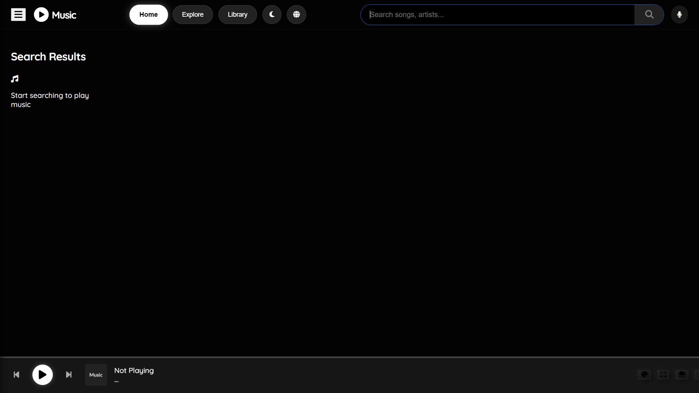
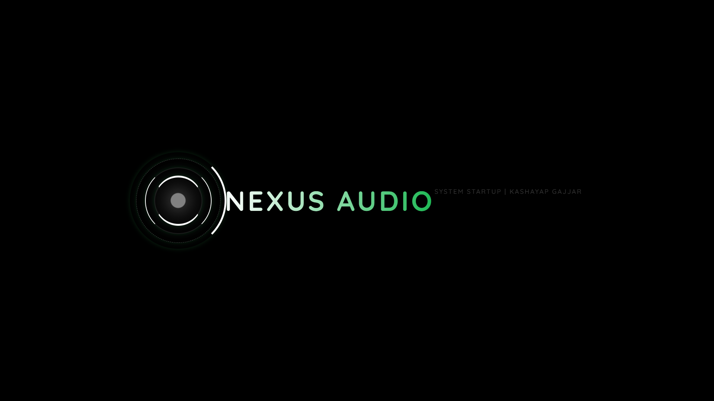

The reason your README.md looks like a giant block of text is that all the line breaks (newlines) are missing.

Markdown, the language used for README files, needs actual "Enter" key presses to know when a heading ends, when a list item starts, or when a code block begins. Without those line breaks, it just mashes everything together into one long paragraph.

To fix this, you need to edit the file on GitHub and replace the content with the correctly formatted version below.

How to fix it immediately:
Go to your GitHub repository page.

Click on the README.md file.

Click the little Pencil Icon (Edit file) in the top right corner of the file view.

Delete everything currently in that box.

Copy and Paste the exact text below into the box.

Scroll down and click the green "Commit changes" button.

Here is the corrected text:

Markdown

# 🎵 Nexus Audio (K-Sonic Engine)
### The Ultimate Local-Hosted Universal Music Aggregator

   

**Nexus Audio** (codenamed *K-Sonic*) is a next-generation music player built on a hybrid architecture. It combines the power of a **Python Backend** (Flask) with a modern **Web Frontend** to aggregate music from YouTube, JioSaavn, and SoundCloud into a single, ad-free, high-performance interface.

---

## 📸 Gallery

| **Home View** | **Default Player** |
|:---:|:---:|
|  |  |

| **Loading Screen** | **Terminal / Backend** |
|:---:|:---:|
|  |  |

---

## 🚀 Key Features

* **Universal Search Aggregator:** Searches multiple platforms simultaneously using parallel threading for instant results.
* **K-Sonic Audio Engine:**
  * **10-Band Equalizer:** Professional audio shaping.
  * **Bass Boost & 8D Audio:** Real-time Web Audio API processing.
  * **Lo-Fi Rain Mode:** Toggleable background ambiance for focus.
* **Smart "Velocity" Cache:** Intelligently caches audio links to ensure songs load instantly on replay.
* **AI Recommendations:** "Up Next" suggestions powered by algorithmic matching.
* **Visualizers:**
  * **Footer Mode:** Lightweight frequency bars.
  * **Zen Mode:** Full-screen immersive visualizer.
* **Library System:**
  * **Playlists:** Create and manage custom playlists via SQLite database.
  * **Favorites:** Quick-save songs to your local library.
* **Party Mode:** Host the server on your PC and control it via your phone on the same Wi-Fi.
* **Anti-Copy Protection:** Encrypted startup sequence and splash screen.

---

## 🛠️ Installation Guide

### Prerequisites
1. **Python 3.10+**: [Download Here](https://www.python.org/downloads/)
2. **FFmpeg** (Optional but Recommended for stable streaming): [Download Here](https://ffmpeg.org/download.html)
   * *Add FFmpeg to your System PATH.*

### Setup Steps

1. **Clone/Download the Repository**
   ```bash
   git clone [https://github.com/GajjarKashyap/Audio.git](https://github.com/GajjarKashyap/Audio.git)
   cd Audio
Install Dependencies Open your terminal/command prompt in the project folder and run:

Bash

pip install flask requests yt-dlp
Initialize the System Run the included batch file to start the server automatically:

DOS

run_nexus.bat
Alternatively, run via Python:

Bash

python app.py
Access the Player The app will automatically open in your default browser at: http://127.0.0.1:5000

🎮 How to Use
1. Searching & Playing
Type any song, artist, or album in the Top Search Bar.

Click the Play Icon on any card to start streaming.

The "Up Next" section will automatically populate with similar songs.

2. Managing Playlists
Click the Sidebar Menu (Hamburger icon).

Select "+ New Playlist" to create a folder.

On any song card, click the "+" Button to add it to a specific playlist.

3. Audio Effects (FX)
Bass Boost: Click the ⚡ (Bolt) icon in the footer.

Lo-Fi Rain: Click the ☁️ (Cloud) icon to add rain sounds.

Zen Mode: Click the ⛶ (Expand) icon for full-screen visuals.

4. Sleep Timer
Click the Moon Icon in the top navigation bar to set a timer (10m, 30m, 1hr). The system will fade out audio and shut down automatically.

⚠️ Disclaimer
Plaintext

THIS PROJECT IS BUILT STRICTLY FOR EDUCATIONAL PURPOSES ONLY.

1. Non-Commercial Use: This software is designed to demonstrate skills in 
   Python, Flask, API integration, and Web Audio API. It is NOT intended 
   for commercial distribution.

2. Copyright Compliance: This tool acts as a search engine and proxy. 
   It does not host any copyrighted files. Users are responsible for 
   ensuring they have the right to access content from third-party 
   platforms (YouTube, JioSaavn, SoundCloud) in accordance with their 
   respective Terms of Service.

3. No Liability: The developer (Kashayap Gajjar) assumes no liability 
   for any misuse of this software.
👨‍💻 Developer
Developed & Architected by:

KASHAYAP GAJJAR
Core Logic: Python (Flask, Threading)

UI/UX Design: HTML5, CSS3 (Glassmorphism/Matte), Vanilla JS

Database: SQLite3

© 2025 Kashayap Gajjar. All Rights Reserved.

