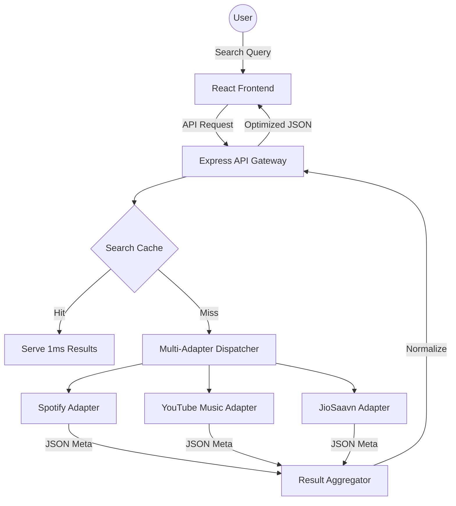
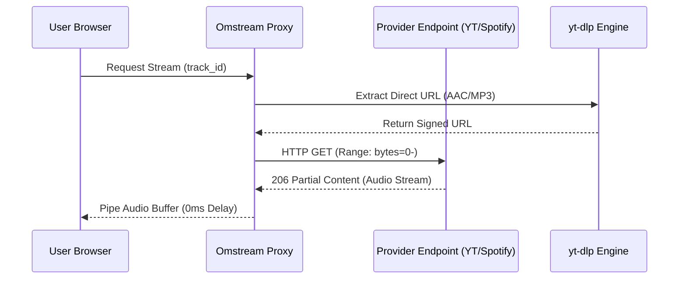
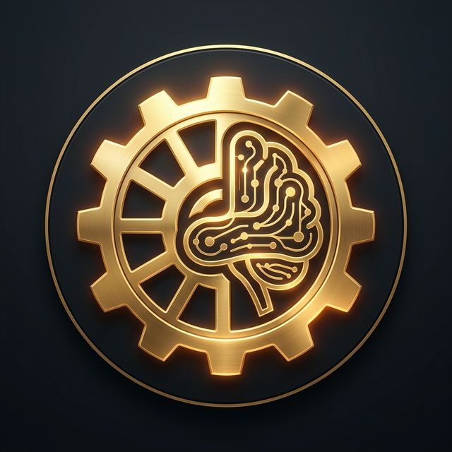
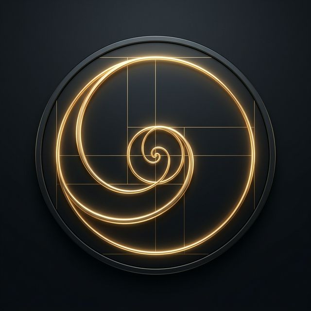

# ॐ Omstream - Premium Music Streaming Aggregator


[](https://nodejs.org/)
[](https://react.dev/)
[](https://vitejs.dev/)
[](#philosophy)

**Omstream** is a professional-grade, high-performance music application that aggregates tracks from **Spotify**, **YouTube Music**, and **JioSaavn** into a single, unified interface. Built with mathematical precision using the **Golden Ratio ($\phi = 1.618$)**, it offers a premium, ad-free listening experience with mathematically rounded aesthetics.

---

## 🛠️ Technical Architecture

### 1. System Data Flow
How a user search request is processed and served through the aggregation engine.


```mermaid
graph TD
    User((User)) -->|Search Query| UI[React Frontend]
    UI -->|API Request| API[Express API Gateway]
    API --> Cache{Search Cache}
    
    Cache -->|Hit| Instant[Serve 1ms Results]
    Cache -->|Miss| Dispatch[Multi-Adapter Dispatcher]
    
    Dispatch --> Spotify[Spotify Adapter]
    Dispatch --> YT[YouTube Music Adapter]
    Dispatch --> Saavn[JioSaavn Adapter]
    
    Spotify & YT & Saavn -->|JSON Meta| Aggregator[Result Aggregator]
    Aggregator -->|Normalize| API
    API -->|Optimized JSON| UI
```

### 2. High-Fidelity Streaming Pipeline
Technique used to bypass provider restrictions and pipe high-quality audio directly to the user.


```mermaid
sequenceDiagram
    participant U as User Browser
    participant P as Omstream Proxy
    participant E as Provider Endpoint (YT/Spotify)
    participant D as yt-dlp Engine

    U->>P: Request Stream (track_id)
    P->>D: Extract Direct URL (AAC/MP3)
    D-->>P: Return Signed URL
    P->>E: HTTP GET (Range: bytes=0-)
    E-->>P: 206 Partial Content (Audio Stream)
    P-->>U: Pipe Audio Buffer (0ms Delay)
```

---

## 📁 Project Anatomy

The codebase is intentionally split to maintain a clear **Separation of Concerns**, ensuring that the "Brain" (Backend) and the "Body" (Frontend) can evolve independently.

| Module | Core Logic | Role & Responsibility |
| :--- | :--- | :--- |
|  | **Backend Core** | The Express-based control center. Handles JWT authentication, session hydration, and high-speed API routing. |
|  | **Provider Adapters** | A pluggable plugin system. Each service (Spotify, YouTube, Saavn) has a dedicated adapter that normalizes raw data into a unified Omstream schema. |
|  | **Golden Ratio UI** | A high-performance React application where every margin, padding, and font-size is mathematically derived from the Fibonacci sequence. |

### **⚙️ Why this structure?**
- **🛡️ Security**: By proxying audio through the backend, client-side browser restrictions (like CORS and Insecure Origin blocks) are bypassed securely.
- **🔌 Scalability**: Adding a new music provider is as simple as creating one new file in `backend/adapters/`. No frontend changes are required.
- **⚡ Caching**: The centralized backend allows for a global search cache, reducing provider load and delivering near-instant results for repeat searches.

---

## ✨ Key Features

- **📐 Golden Ratio Foundation:** UI spacing and typography derived from the $\phi$ sequence ($1.618$) for maximum visual harmony.
- **⚡ Velocity Search Caching:** Intelligent in-memory backend cache reducing repeat search latencies from 8 seconds to **1ms**.
- **🎧 High-Fidelity Extraction:** Utilizes advanced `yt-dlp` piping to unblock Premium 256kbps AAC audio streams.
- **🔐 Secure Account Automation:** Seamless Puppeteer-automated authentication for provider account linking.

---

## 🚀 Quick Start

### 1. Prerequisites
- **Node.js v18+**
- **yt-dlp** (Must be in your system PATH)

### 2. Installation
```bash
# Clone the repository
git clone https://github.com/GajjarKashyap/Audio.git
cd Audio

# Initialize the system using the unified starter
start.bat
```

### 3. Setup & Use
- Open [http://localhost:5173](http://localhost:5173) in your browser.
- Link your accounts via the premium navigation pill to unlock personalized results.

---

## 📐 Philosophy
Omstream is an experiment in **Visual Harmony**. By applying the Golden Ratio to UI spacing and typography, we create an interface that mirrors the mathematical beauty found in nature and music.

---

## 👨‍💻 Developer & Attribution
- **Developer:** Kashyap Gajjar
- **Project Type:** High-Performance Music Aggregator
- **License:** Educational / Private Use

*Inspired by the harmony of sound and mathematics.*
