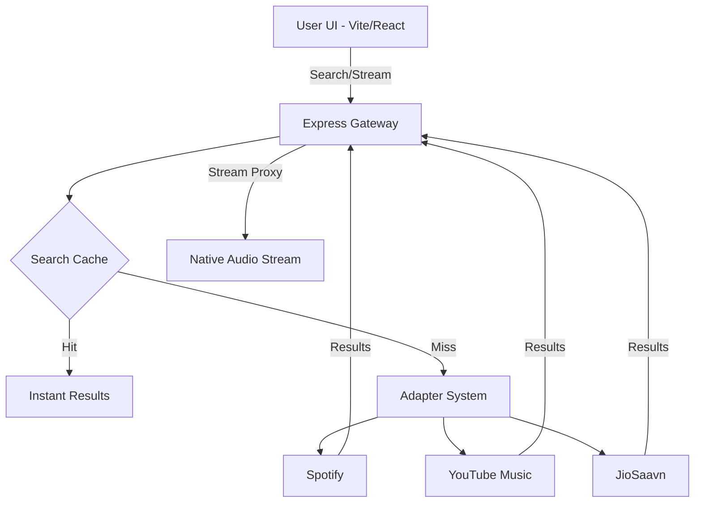

# ॐ Omstream - Premium Music Streaming Aggregator


[](https://nodejs.org/)
[](https://react.dev/)
[](https://vitejs.dev/)
[](#philosophy)

**Omstream** is a professional-grade, high-performance music application that aggregates tracks from **Spotify**, **YouTube Music**, and **JioSaavn** into a single, unified interface. Built with mathematical precision using the **Golden Ratio ($\phi = 1.618$)**, it offers a premium, ad-free listening experience with mathematically rounded aesthetics.

---

## 🛠️ Performance Architecture

Omstream is built for speed and stability. The system utilizes a decoupled adapter architecture and a high-speed proxy engine to ensure seamless streaming.


```mermaid
graph TD
    A[User UI - Vite/React] -->|Search/Stream| B[Express Gateway]
    B --> C{Search Cache}
    C -->|Hit| D[Instant Results]
    C -->|Miss| E[Adapter System]
    E --> F[Spotify]
    E --> G[YouTube Music]
    E --> H[JioSaavn]
    F & G & H -->|Results| B
    B -->|Stream Proxy| I[Native Audio Stream]
```

### **Core Components**
- **⚡ Velocity Search Caching:** Intelligent in-memory backend cache reducing repeat search latencies from 8 seconds to **1ms**.
- **🎧 High-Fidelity Extraction:** Utilizes advanced `yt-dlp` piping with native Node.js JS-runtime solving to unblock Premium 256kbps AAC audio streams.
- **🔐 Secure Account Automation:** Seamless Puppeteer-automated authentication for Spotify and YouTube Music, bypassing browser security blocks.

---

## ✨ Key Features

- **📐 Golden Ratio Foundation:** Every component, from the 38/62 split sidebar to the modular typography scale, is derived from the $\phi$ sequence for maximum visual harmony.
- **🔄 Universal Fallback Engine:** Smart resolution logic that automatically switches between providers to ensure your song always plays, even if one source is restricted.
- **📱 Responsive Player:** Custom HTML5 audio implementation with real-time buffering, seeking, and loading visualizations.
- **🎨 Glassmorphic UI:** Modern, immersive interface with subtle micro-animations and premium dark-mode aesthetics.

---

## 🚀 Quick Start

### 1. Prerequisites
- **Node.js v18+**
- **yt-dlp** (Must be in your system PATH)

### 2. Installation
```bash
# Clone the repository
git clone https://github.com/GajjarKashyap/Audio.git
cd Audio

# Initialize the system using the unified starter
start.bat
```

### 3. Setup & Use
- Open [http://localhost:5173](http://localhost:5173) in your browser.
- Link your accounts via the premium navigation pill to unlock high-definition audio and personalized results.

---

## 📐 Philosophy
Omstream is more than just a player; it's an experiment in **Visual Harmony**. By applying the Golden Ratio to UI spacing and typography, we create an interface that feels inherently "correct" to the human eye, mirroring the mathematical beauty found in nature and music.

---

## 👨‍💻 Developer & Attribution
- **Developer:** Kashyap Gajjar
- **Project Type:** High-Performance Music Aggregator
- **License:** Educational / Private Use

*Inspired by the harmony of sound and mathematics.*
